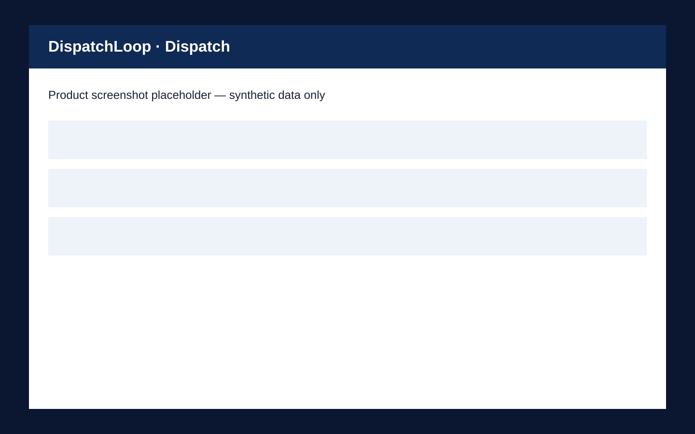

# DispatchLoop

DispatchLoop is a synthetic field-service operations console for calling a professional, collecting a status update in English/Hindi/Hinglish, and applying only deterministic, auditable booking actions. It is an assessment prototype: it has no relationship with Urban Company or any real service marketplace.



## What is included

- Tauri desktop operator console with Dispatch, Booking, Call Trace, and Evals surfaces.
- Hono API with an explicit operator boundary and authenticated Bolna tool boundary.
- Deterministic state policy, audit trail, idempotency, and optimistic concurrency.
- Supabase migration/seed material and mock/fixture/live integration modes.
- A 20-case evaluation suite and an immutable voice prompt v1.

## Quick start

```sh
cp .env.example .env
pnpm install
pnpm verify
pnpm dev:api
pnpm dev:desktop
```

Use `INTEGRATION_MODE=mock` locally. The desktop asks for the operator token at runtime; do not put it in `VITE_*` configuration. A live call requires the server-only Bolna and recipient variables described in [security](docs/security.md).

## Guardrails

The desktop never sends a phone number. The backend owns the safe demo recipient, validates each tool request, enforces policy in an atomic database operation, and records a redacted audit event. A webhook is merely a notification: the backend verifies a known execution and reads canonical provider data before accepting it. `call-disconnected` is not terminal.

## Evidence labels

Every evaluation and trace uses one of `live_call`, `bolna_fixture`, or `deterministic_test`. Fixture and mock evidence are useful for reproducibility but are never presented as live-call proof.

## Release status

CI builds a macOS ARM64 and Windows x64 artifact. Neither is signed or notarized unless credentials are supplied. See [known limitations](docs/known-limitations.md) before a public demo.

## Documentation

- [Architecture](docs/architecture.md)
- [Security model](docs/security.md)
- [Five-minute demo](docs/five-minute-demo.md)
- [Failure-analysis template](docs/failure-analysis.md)
- [Screenshot convention](docs/screenshots/README.md)
