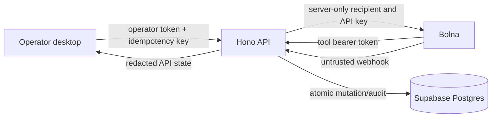

# Architecture

The desktop is an operator view only. It requests a call with a booking ID and never supplies a telephone number. The API creates and tracks the call, then provides safe booking/call views.

Voice actions pass through seven authenticated tools. Each mutation reads the current booking version, uses an idempotency key, and is evaluated by deterministic policy before a single atomic database transaction writes booking state, tool outcome, and audit evidence.

Provider webhooks are not authoritative state transitions. The API first confirms that the local call owns the execution ID, then reads the canonical execution record before accepting a monotonic lifecycle update. A disconnected call remains open pending an actual terminal provider state.
